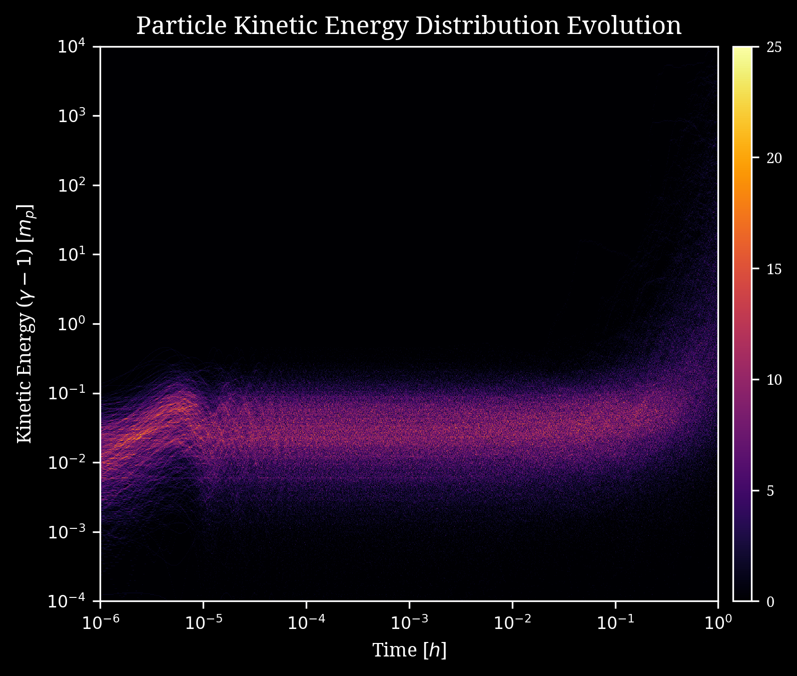

# Particle Acceleration Hands-On

Tutorial for Particle Acceleration Hands-On session: CTA School 2017, Sao Paulo.

This is the tutorial for the hands on, a practical session on the simulations of test particle acceleration for the [São Paulo School of Advanced Science on High Energy and Plasma Astrophysics in the CTA Era](http://www.astro.iag.usp.br/~highenastro/). Theere are several goals of this activity:
- to learn how to integrate the particle equation of motion numerically,
- to help you understand how a charged particle moves in magnetic fields,
- to learn how to analyze a single particle motion,
- to learn how to analyze statistical properties of motion of an ensemble of particles, such as the energy distribution.

[Pre-requisites](./pre-requisites.md), including instructions for [downloading](./pre-requisites.md#download-links) and [installing](./pre-requisites.md#instructions-for-installing-vm) the VM

# Introductory presentation

A copy of the introductory presentation is in the file [Intro.pdf](https://github.com/gkowal/Particle-Acceleration-tutorial/blob/master/Intro.pdf).

# PAccel code

It is a Fortran code which integrates the particle trajectory (proton or electron) in a predefined uniform or curved magnetic field or magnetic and plasma velocity fields taken from an external simulation.

The code is provided in directory `~/Particle_Acceleration/00_paccel_code/` of your virtual machine image. It can be also downloaded or cloned from the GitHub repository:
```
[fermi@localhost ~]$ git clone https://github.com/gkowal/paccel.git
```
There are a few important files which you may want to modify:
- `make.conf` in which several compilation flags are included, in particular the test problem is set from here,
- `params.in` in which the runtime parameters can be changes.

Once compiled, you can run `./paccel.x` which produces the output like

```
------------------------------------------------------------------------------
===        PAccel algorithm started         ==================================
===  Copyright (C) 2008-2010 Grzegorz Kowal ==================================

TASK      : integrating the trajectory of a charged particle
INFO      : reading parameters
INFO      : initializing the particle positions and velocities
INFO      : plasma parameters:
INFO      : c     = 2.00000000E+01 [Va]
INFO      : Va    = 1.50083951E+07 [m / s]
INFO      : dens  = 1.00000000E+00 [u / cm^3] = 1.67262159E-21 [kg / m^3]
INFO      : <B>   = 6.88078569E-03 [G]
INFO      : particle parameters:
INFO      : trajectory for proton
INFO      : e/m   = 9.57883407E+03 [1 / G s]
INFO      : Vpar  = 1.00000000E-02 [c] = 2.99792458E+06 [m / s]
INFO      : Vper  = 1.00000000E-01 [c] = 2.99792458E+07 [m / s]
INFO      : |V|   = 1.00498756E-01 [c] = 3.01287692E+07 [m / s]
INFO      : gamma = 1.00508858E+00
INFO      : Om    = 6.55762147E+01 [1 / s]
INFO      : Tg    = 9.58150045E-02 [s]
INFO      : Rg    = 4.57166458E+05 [m] = 1.48157559E-11 [pc]
INFO      : mu    = 1.09237330E-10 [N m / Gs]
INFO      : E0    = 9.38271999E+02 [MeV]
INFO      : geometry parameters:
INFO      : T     = 1.00000000E+00 [s] = 3.16887646E-08 [yr]
INFO      : L     = 1.50083951E+07 [m] = 4.86388961E-10 [pc]
INFO      : Rg/L  = 3.04607157E-02
INFO      : Tg/T  = 9.58150045E-02
INFO      : code units:
INFO      : e/m   = 6.59099044E+01
INFO      : integrating the particle trajectory (RK4 method)
PROGRESS  :     ITER            TIME      TIMESTEP     SPEED (c)  ENERGY (MeV)
PROGRESS  :      894    1.000063E+01  1.119761E-03  1.004987E-01  4.774469E+00
COMPUTED  : computing done in  4.10156E-02 seconds
INFO      : deallocating the particle
INFO      : deallocating the field components
```

It also produces an ASCII file called `output.dat` which contains all particle parameters, such as the position coordinates, velocity components, energy, etc.

# Tutorials

## Tutorial 1 - Proton motion in a uniform magnetic field.

In this tutorial we integrate and visualize motion of a proton in magnetic field which is uniform.

Initial steps:
- go to `./00_paccel code/`,
- call `make clean` in the terminal,
- make sure the line `TEST=` in `make.config` is set to `WAVE`,
- compile the code: `make`,
- copy the executable file `paccel.x` to directory `../01_Buniform/`, i.e. `cp ./paccel.x ../01_Buniform/`,
- go to directory `../01_Buniform/`, i.e. `cd  ../01_Buniform/`.

The are a few runtime parameters which can be changed in the file `params.in`:
- `ptype = 'p'` or `ptype = 'e'` for proton or electron, respectively,
- `xc`, `yc`, `zc` - the initial particle position,
- `vpar` and `vper` for the parallel and perpendicular component with respect to the direction of the local field, respectively, in units of the speed of light, c,
- `bini` - the strength of the magnetic field.

**Tasks to do**: Change some of these parameters and visualize the particle trajectory.
- Determine the Larmor radius and gyroradius after each modification using the data from file `./output.dat`.
- Using the code output determine the unit conversion necessary to express all results in physical units.

In order to visualize the trajectory, energy or velocity components (parallel and perpendicular to the local field) you can use provided [GNUPlot](http://www.gnuplot.info/) scripts: `plot_trajectory.gpl`, `plot_energy.gpl`, `plot_velocity.gpl`.


## Tutorial 2 - Proton motion in a non-uniform magnetic field. Magnetic mirror case.

In this tutorial we integrate and visualize motion of a proton in magnetic field which has a varying curvature. In the result, the particle is trapped bouncing back and forth. This effect is called **magnetic mirror** or **magnetic bottle**.

Initial steps:
- go to `./00_paccel code/`,
- call `make clean` in the terminal,
- make sure the line `TEST=` in make.config is set to `ISLAND`,
- compile the code: `make`,
- copy the executable file `paccel.x` to directory `../02_Bmirror/`: `cp ./paccel.x ../02_Bmirror/`,
- go to directory `../02_Bmirror/`: `cd  ../02_Bmirror/`.

Additionally to all runtime parameters described in the previous tutorial you can also change:
- `bamp` - determines the eccentricy of the magnetic field loop; if `bamp = 0.0` the loop is perpectly circular; for `bamp > 0` it is elongated toward the X direction;

**Tasks to do**: As in the previous tutorial, change some of these parameters and visualize the particle trajectory.
- Determine the Larmor radius in each case using the data from file `./output.dat`.
- Determine the moments at which the particle changes the direction of parallel motion.
- Determine the mirror effect condition considering conversation of the magnetic moment and total energy.

In order to visualize the trajectory, energy or velocity components (parallel and perpendicular to the local field) you can use provided GNUPlot scripts: `plot_trajectory.gpl`, `plot_energy.gpl`, `plot_velocity.gpl`


## Tutorial 3 - Proton motion in turbulent magnetic field.

In this tutorial we integrate and visualize motion of a proton in turbulent magnetic field taking into account the turbulent plasma motion (electric field generated by moving plasma). For this, we need external data stored in the FITS format, which are available in the subdirectory `~/Particle_Acceleration/03_Bturbulent/`.

In order to add support for FITS files, we need to download and compile the CFITSIO library:
- download the recent version of CFITSIO library: `wget -c http://heasarc.gsfc.nasa.gov/FTP/software/fitsio/c/cfitsio3410.tar.gz`,
- unpack it: `tar xzvf cfitsio3410.tar.gz`,
- go to directory cfitsio: `cd cfitsio`,
- configure the library sources: `./configure`,
- compile the library sources: `make`,
- copy the library to paccell directory: `cp ./libcfitsio.a ../00_paccel_code/`

Now, you can continue with the PAccel code compilation:
- go to `./00_paccel code/`,
- call `make clean` in the terminal,
- make sure the line `TEST=` in make.config is set to `N`,
- compile the code: `make`,
- copy the executable file `paccel.x` to directory `../03_Bturbulent/`: `cp ./paccel.x ../03_Bturbulent/`,
- go to directory `../03_Bturbulent/`: `cd  ../03_Bturbulent/`.
- run the paccel executable: `./paccel.x`

**Tasks to do**: Change the initial position and velocity of particle some of these parameters and visualize the particle trajectory.
- Write a script in python to calculate the particle energy gain/loss rate and plot how it changes over time (to read ASCII data you can use subroutine [numpy.loadtxt](https://docs.scipy.org/doc/numpy/reference/generated/numpy.loadtxt.html)).
- Determine the mean energy gain rate.


## Tutorial 4 - Analysis of the statistical properties of ensemble of test particles.

In this tutorial we analyze the statistical properties of an ensemble of test particles. Determine their power spectrum, identify the thermal and non-thermal part, determine the changes of temperature, etc.

The files containig already integrated particle trajectories are provided in your VM image, in the directory `~/Particle_Acceleration/04_Bturbulent_multi/`. We have five files containing data for 1000 particles:
- `time.fits.gz` - time moments for all particle snapshots (Ns);
- `components.fits.gz` - velocity components (total, parallel and perpendicular) for all particles (3 x Np x Ns);
- `energy.fits.gz` - the kinetic energy for all particles at all snapshots (Np x Ns);
- `gperiod.fits.gz` - the gyroperiod for all particles at all snapshots (Np x Ns);
- `gradius.fits.gz` - the gyroradius (Larmor radius) for all particles at all snapshots (Np x Ns);

Above, there are provided the dimensions of arrays stored in each file, where Np is the number of particles and Ns is the number of snapshots.

In the same directory, you will find several scripts written in python, which with the help of packages NumPy and Matplotlib generate evolution of some quantities, e.g. the energy distribution evolution shown below.



**Tasks to do**: Using the provided data (e.g. files `time.fits.gz` and `energy.fits.gz`), analyze the final energy distribution of particles:
- prepare the log-log plot of particle energy histogram,
- determine the particle temperature by fitting the thermal distribution,
- determine the inclination of the high energy tail.


# Contact

Grzegorz Kowal: <grzegorz.kowal@usp.br>
